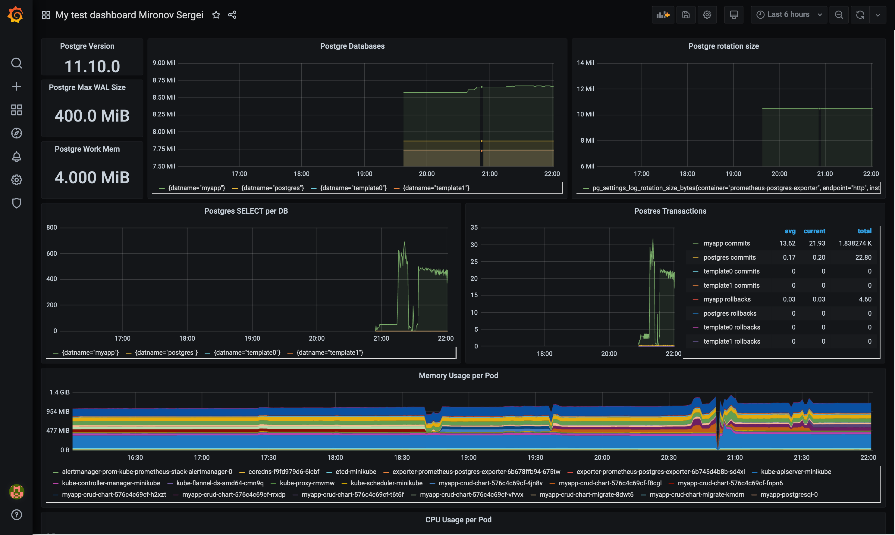
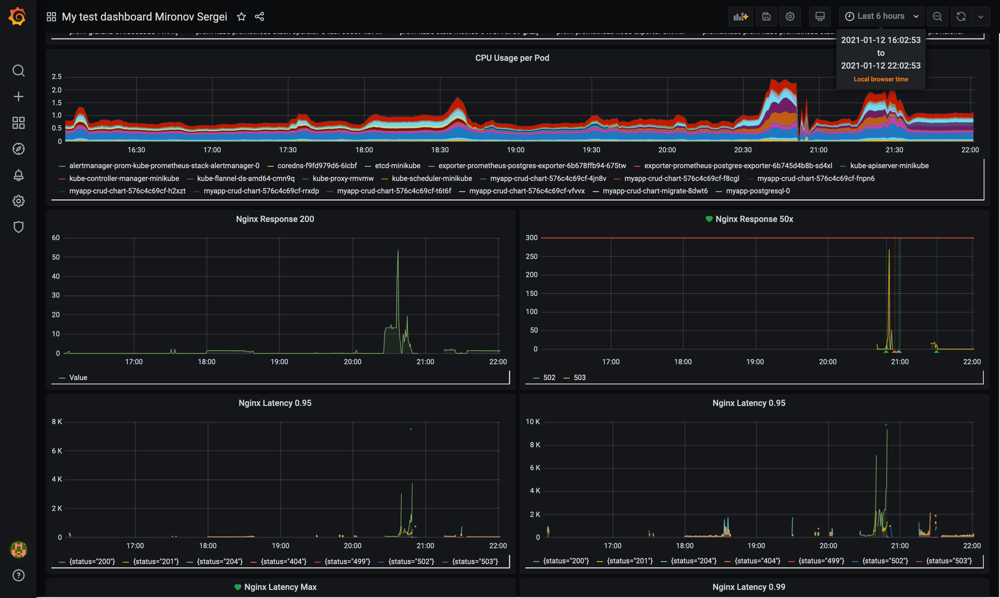
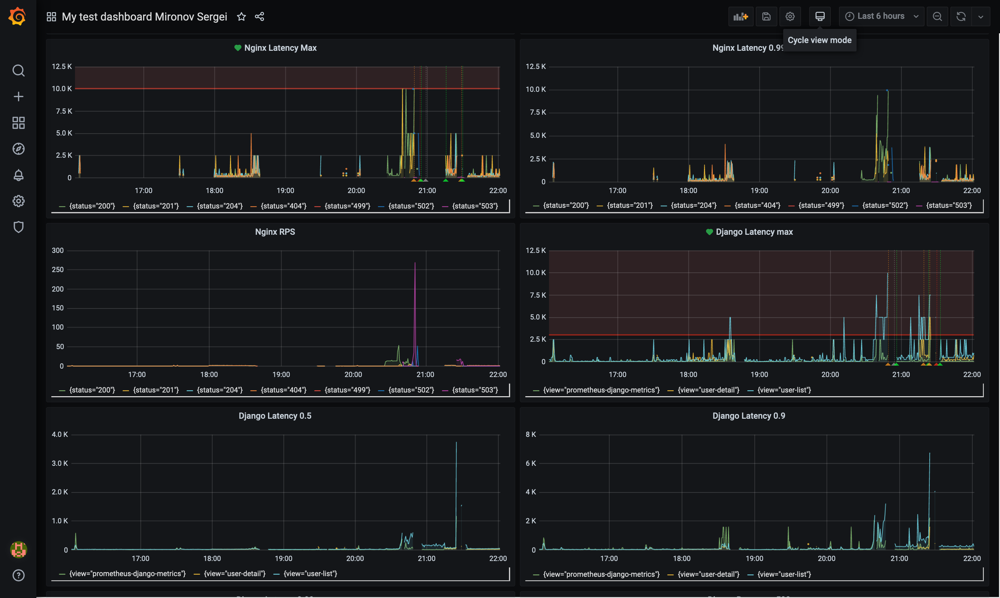
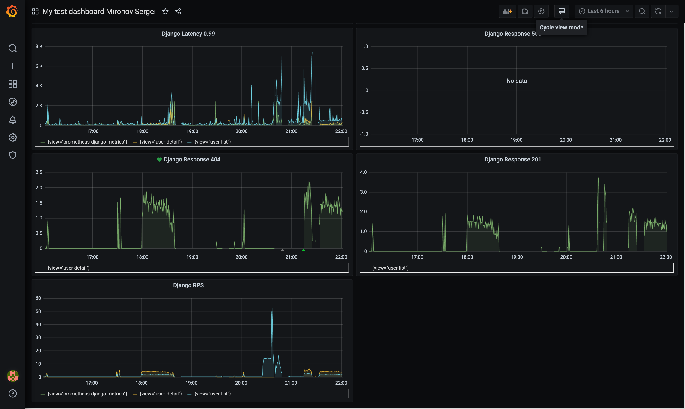

# otus_software_architect
Software architect course, homework 3


# Описание
* Для выполнения задания был использован django-prometheus модуль, который был установлен как зависимость приложения;
* Для работы метрик nginx-ingress добавил в его чарт: metrics.serviceMonitor.enabled=true;
* Для мониторинга базы данных PotgreSQL был использован Prometheus Postgres Exporter из официального репозитория:
```
https://github.com/prometheus-community/helm-charts/tree/main/charts/prometheus-postgres-exporter
```
* Официальная борда графаны для него:
```
https://grafana.com/grafana/dashboards/9628
```
* Экспортированный json борды:
```grafana-dashboard.json```
  
* Просмотреть Prometheus Postgres Exporter доступные метрики :
```
kubectl port-forward service/myapp-prometheus-postgres-exporter 9091:80
http://localhost:9091/metrics
```
Пример реальных ответов индпоинта можно посмотреть в файле:
```
all_postgres_exporter_metrics.txt
```

### Screenshoots
После 20 минут нагрузки





### URLs

```
POST http://arch.homework/otusapp/mironov/api/v1/users/
GET http://arch.homework/otusapp/mironov/api/v1/users/<id>/
PATCH http://arch.homework/otusapp/mironov/api/v1/users/<id>/
DELETE http://arch.homework/otusapp/mironov/api/v1/users/<id>/
GET http://arch.homework/otusapp/mironov/metrics
```

### How to deploy chart?

```helm install myapp ./crud-chart```
myapp - for postgres exporter needed

### How to run postman tests with newman?
```
docker run --rm -it -v "$PWD"/homework3.postman_collection.json:/collection.json --entrypoint=sh postman/newman:alpine
echo "192.168.64.9 arch.homework" >> /etc/hosts
newman run /collection.json
```

### How to test endpoints with ab?
```
while true; do ab -n 50 -c 5 http://arch.homework/otusapp/mironov/api/v1/users/ ; sleep 3; done
```

# Install instructions

# minikube install
```shell script
minikube start \
--cpus=4 --memory=5g \
--kubernetes-version v1.19.3 \
--cni=flannel --vm=true --driver=hyperkit \
--extra-config=apiserver.enable-admission-plugins=NamespaceLifecycle,LimitRanger,ServiceAccount,DefaultStorageClass,\
DefaultTolerationSeconds,NodeRestriction,MutatingAdmissionWebhook,ValidatingAdmissionWebhook,ResourceQuota,PodPreset \
--extra-config=apiserver.authorization-mode=Node,RBAC
```

### prepare minikube
```
minikube addons disable ingress
kubectl create namespace monitoring
kubectl config set-context --current --namespace=monitoring
```

### prometheus install
```
helm repo add prometheus-community 
helm repo add stable 
helm repo update
helm install prom prometheus-community/kube-prometheus-stack -f prometheus.yaml
```

### ingress install
```
helm repo add ingress-nginx 
helm repo update
helm install nginx ingress-nginx/ingress-nginx -f nginx-ingress.yaml
```

### Port forward:
```
kubectl port-forward service/prom-grafana 9000:80
kubectl port-forward service/prom-kube-prometheus-stack-prometheus 9090
```
