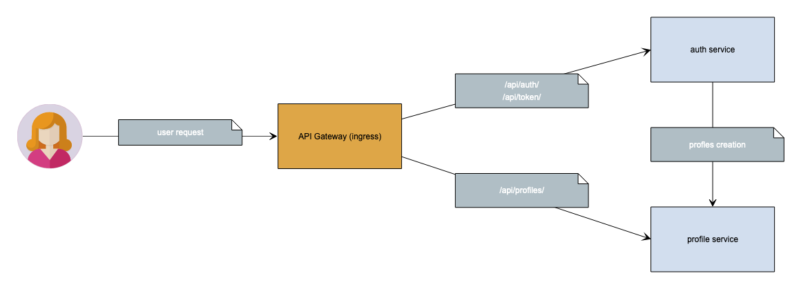

# otus_software_architect
Software architect course, homework 5

# Microservices diagram



## Microservices description

### Auth service
- /api/auth/users/ endpoint for users creation (sign up)
- /api/token/ endpoint for token creation (login)
- create user profile in profiles service

### Profiles service
- /api/internal/profiles/ endpoint only for an internal network (auth service usage)
- /api/profiles/<username> endpoint for profile view and change
- authenticate by signed jwt token (username field)

# How to install

### Ingress install
I used kubernetes-desktop from docker-desktop package. I install nginx-based ingress with:
```shell
helm repo add ingress-nginx 
helm install nginx ingress-nginx/ingress-nginx
```

### Deploy services

```shell
kubectl apply -f deploy-services.yml
```

### Homework tests:

```shell
newman run homework5.postman_collection.json
```