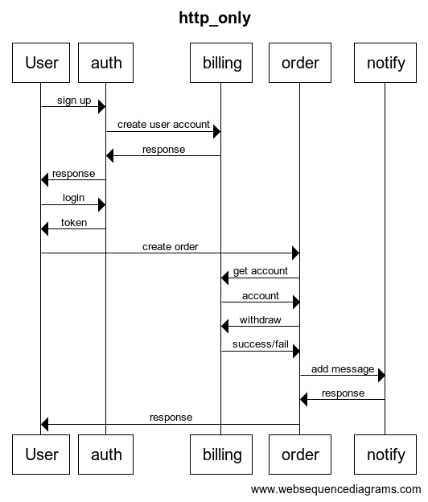
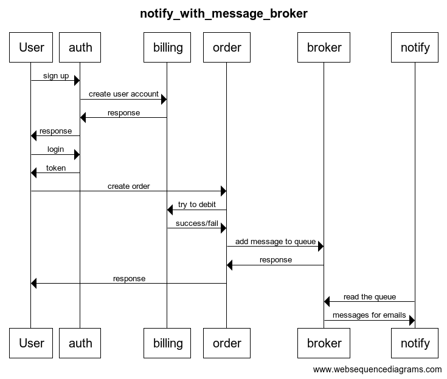
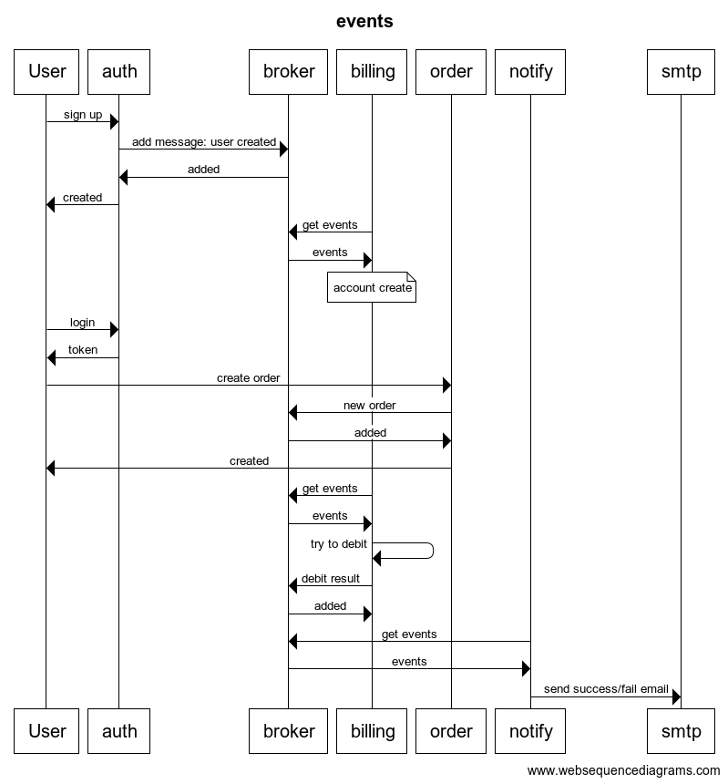
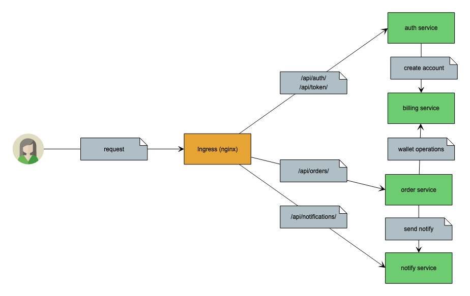

# otus_software_architect
Software architect course, homework 6

# Theoretical part

## Http only services collaboration



## Notify service message broker collaboration



### the most reasonable way

## Full events collaboration



# Practice part

## Microservices diagram



## Microservices description

I implemented http only scheme.

### Auth service
- /api/auth/users/ endpoint for users creation (sign up)
- /api/token/ endpoint for token creation (login)
- create user account in billing service
- OpenApi file: open-api/auth.json

### Billing service
- /api/internal/profiles/ endpoint only for an internal network (auth service usage)
- /api/billing/<username> endpoint for account view and change
- authenticate by signed jwt token (username field)
- OpenApi file: open-api/billing.json

### Order service
- /api/orders/ endpoint for order creation
- validate jwt token, if ok try to debit in billing service (with user jwt)
- send notification to notify service
- OpenApi file: open-api/order.json

### Notify service
- /api/notifications/ endpoint for notifications creation
- OpenApi file: open-api/notify.json

# How to install

### Ingress install
I used kubernetes-desktop from docker-desktop package. I install nginx-based ingress with:
```shell
helm repo add ingress-nginx 
helm install nginx ingress-nginx/ingress-nginx
```

### Deploy services

namespace: default
```shell
kubectl apply -f deploy-services.yml
```

### Homework tests:

```shell
newman run homework6.postman_collection.json
```