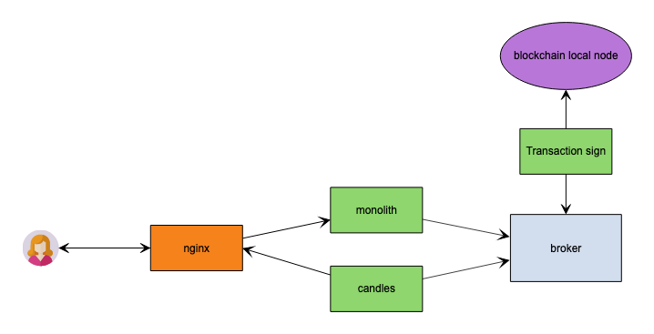
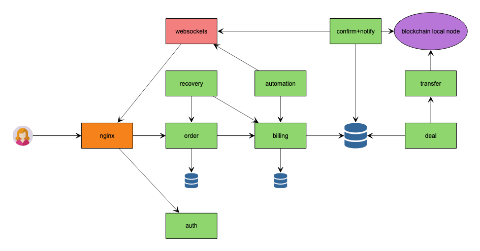
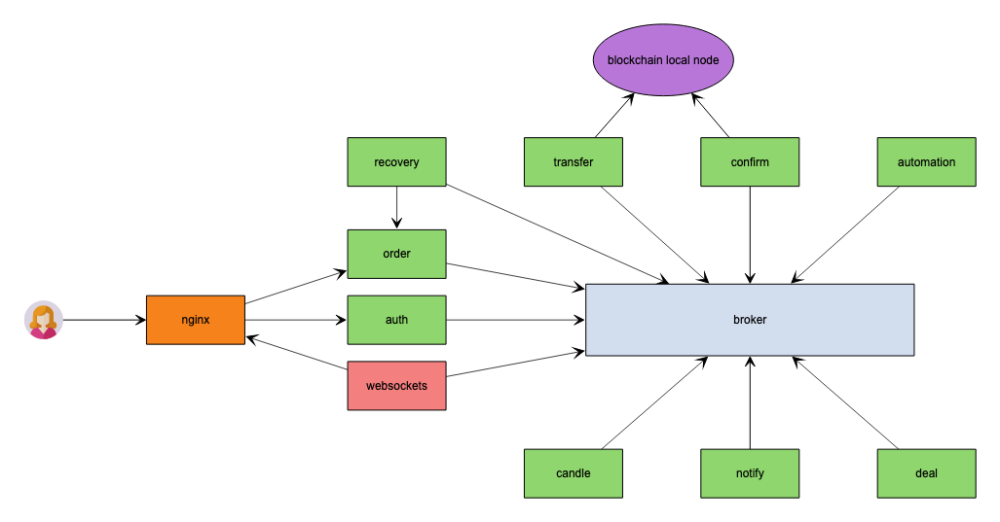
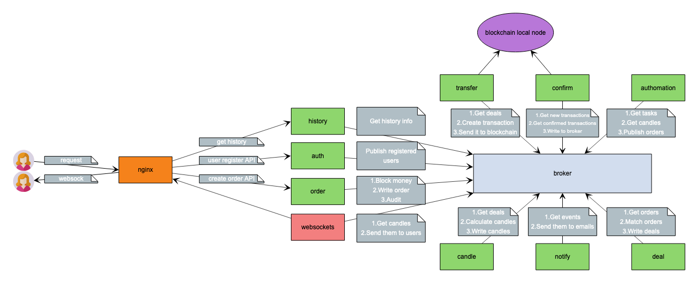

# otus_software_architect
Software architect course, homework 8

# Пользовательские сценарии

- Пользователь может зарегистрироваться, тогда ему приходит сообщение на емейл.
- Пользователь может сделать заказ, деньги на счету валюты 1 блокируются, заказ попадает в стакан.
- Пользователь делает заказ, при этом денег на счету не хватает, тогда ему приходит отказ.  
- Пользователь получает зачисление средств на счет валюты 2 после выполнения заказа, пользователь получает уведомление на email.
- Пользователь получает сообщения о котировках через веб-сокет сервер.
- Пользователь может установить триггер на продажу/покупку при определенном курсе валюты.

## Системные сценарии

- Заказы осуществляются на паре 2х валют.
- На основе сделок в "стакане" мы рассчитываем котировки.
- После сделки мы подписываем транзакции и исполняем их в блокчейне.
- Периодчески мы проводим аудит логов, подсчитывая количество операций по каждому кошельку и сравниваем со значением счета.

# Варианты декомпозиции системы

Все сущности можно разделить на 3 домена:
1.Пользовательский домен, мы проверяем количество денег на валютном счету, списываем их, работаем с аккуантами пользователей, имеет индпоинты для реализации пользовательского функционала. Проведение сделок, торговля. 
2.Домен блокчена, здесь мы формируем транзакции, подписываем их, отправляем, контролируем выполнение.
3.Домен информации, котировки или свечи вычисляемые на основе сделок, уведомления пользователям.

## Вариант 1, event collaboration
На первом этапе можно предложить простую схему, которая позволяет реализовать весь функционал, 1 домен = 1 сервис.
- monolith - пользовательский домен
- transactions - формирование транзакций
- candles - сервис вычисления свечек, и уведомлений через websockets и email

## Вариант 2, http взаимодействие

Мы можем использовать "классическую" http взаимодейтсвие, тогда на входе системы можно сделать 2 сервиса обеспечивающие авторизацию/аутентификацию:
- auth/order - order валидирует ордер через сервис биллинга, резирвирует сумму на счет и возвращает ответ клиенту.
- billing - не имеет валидацию запросы, по этой причине сервис authomation может создавать (если хватает денег на счету клиента) заказы, если пользователь установил триггер.
- recovery - проводит аудит логов.
- confirm-notify сервис для уведомления пользователей, расчет котировок.
Отдельно стоит отметить ситуацию с базами даннных, в это случае в системе используется Redis или другое in-memory хранилище, для матчинга заказов, рачета котировок. При это сервисы:
- order
- billing
точно имеют некие базы, для хранения логов.

## Вариант 3

Если декомпозировать еще больше, можно прийти к состоянию:

Cервис billing имеет высокую связность с другими сервисами и т.к. нет смысла создавать заказ, если денег на счету не достаточно, то имеет смысл объединить сервис order и billing.

Мы выделяем отдельные сервисы:
- auth - регистрация пользователей и создание токенов, можем использовать ldap.
- order - сервис включащий в себя работу с заказами, проверку денег на счет
- transfer - создание транзакций, отправка
- confirm - сервис слушающий ноду и репортящий о проведенных транзакций
- recovery - сервис аудит, ведет подсчет финансовых операций и сравнивает с текущим состоянием счета
- websockets - сервис стриминга котировок
- candles - расчет котировок (свечей)
- notify - уведомление пользователей о заказах
- deal - сервис сделок (стакан), матчинг заказов
- authomation - сервис для выполнения триггеров пользователей

# Описание финального решения

В "центр" системы я поместил брокер сообщений, который хранит все записи, что предоставляет само по себе является финансовым логом. Предлагается использовать kafka, т.к. rabbitmq не имеет функции хранения.

### Замечание 1
Как можно было заметить в предыдущих схемах сервис recovery имеет не большую устойчивость (высокую связность), т.к. ему нужна информация по:
- текущее значение счета
- лог
Стоит его объединить с сервисом order и запускать как отдельную джобу.

### Замечание 2
Из-за блокчейна, который имеет распределенную структуру, то намного удобнее строить асинхронную систему, у ее сервисов более четкие зоны ответственности, многие сервисы являются stateless.

### Замечание 3
В такой сложной системе как криптовалютная биржа с большим количеством функций, отложенных событий очень удобно в центре системы использовать хранилище, предоставляющее в конечном счете финансовый лог.

## Архитектурная схема решения

## Контракты

### auth
- Предоставляет возможность пользователю зарегистрироваться и получить токен;
- /api/auth/users/ индпоинт для регистрации, управление паролями;
- /api/token/ индпоинт для получения токена;
- После успешной регистрации сервис записывает событие об этом в брокер.

### order
- Позволяет пользователю сделать заказ, проверить валютный счет.
- /api/orders/ индпоинт для создания заказов.
- /api/users/ индпоинт для проверки и пополнения счетов по валютам.
- /api/currencies/ индпоинт для получения валют.
- После успешного списания денег со счета, создается сообщение в брокере.
- Джоба сервиса выполняет аудит.
- Слушает брокер для получения заявок от сервиса automation на автоматизированное создание order'ов.

### websockets
- Сервер уведомляющий пользователя о:
    - котировках;
    - проведенных транзакциях.
- Информацию получает из брокера сообщений.

### transfer
- Сервис является "хранителем" настоящих "кошельков" пользователей.
- При регистрации пользователя создаем кошелек и сообщаем об этом в брокер сообщений.
- Получает сообщения о том, какие транзакции нужно создать.
- Создает транзакции, подписывает и отправляет в блокчейн.

### confirm
- Получает сообщения о транзакции в статусе "ожидание проведения" из брокера.
- Случшает ноду блокчейна, получает завершенные транзакции.
- Сообщает в брокер о проведенных транзакциях.

### authomation
- Получает котировки (свечи) из брокера сообщений.
- Если ситуация удовлетворяет условиям созданного триггера, то помешает заказ в брокер для сервиса order.

### candle
- Получает лог финансовых сделок из брокера сообщений.
- Рассчитывает свечи.
- Записывает из обратно брокер.

### notify
- Получает из брокера уведомления для пользователей на email:
    - адрес кошелька;
    - проведенные транзакции;
    - сброс пароля;
    - успешность регистрации.

### deal
- Получает из брокера информацию о подтвержденных ордерах.
- Помещает во внутреннюю память.
- Матчит.
- Записывает уведомление в брокер о результатае проведения сделки.

### broker
- Хранит сообщение.
- Может иметь авто ротацию записей.
- Являет финансовым логом и историей котировок.
- Вместе с брокером может работать ksqldb для сервиса order

### history 
- Сервис истории предоставляет различную информацию.
- /api/history/finance/ предоставляет пользователю историю его финансовых операций.
- /api/history/candles/ предоставляет пользователю котировки в прошлом.
- Данные получает из брокера, вероятно по средством ksqldb.

### nginx
- Проксирует запросы.
- Осуществялет авторизацию.