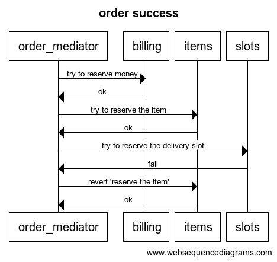
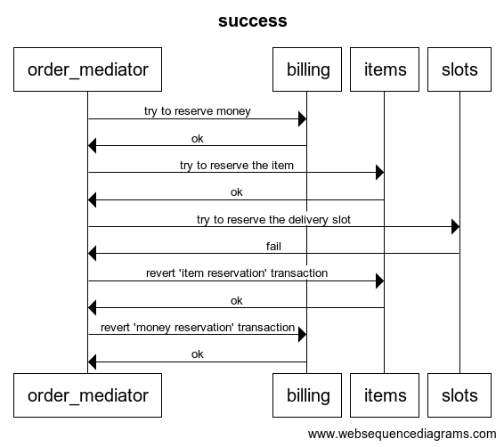
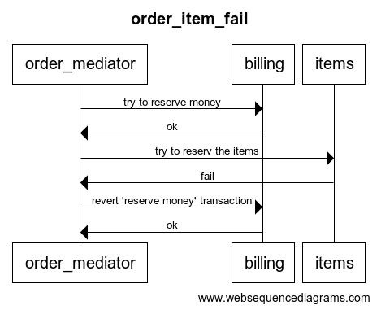
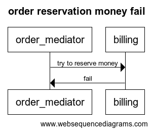

# otus_software_architect
Software architect course, homework 9

# Solution description

## Auth service
- /api/auth/users/ endpoint for users creation (sign up)
- /api/token/ endpoint for token creation (login)
- create user account in billing service with wallet=100

## Billing service
- /api/profiles/ endpoint only for auth service usage
- /api/accounts/<username> endpoint only for order service usage

## Order service
- /api/orders/ endpoint for order creation
- validate request by jwt token
- add order to Redis (queue)

## Order mediator service
- Saga orchestrator
- Listen Redis queue
- Start order:
    - Reserve money in Billing service
    - Reserve the item in Items service
    - Reserve the delivery slot in Slots service

## Items service
- Does not provide external endpoints
- Execute all requests in transaction mode
- Provide item reservation or cancellation
- Start with prefill database function

## Slots service
- Does not provide external endpoints
- Execute all requests in transaction mode
- Provide slot reservation or cancellation
- Start with prefill database function

# Saga orchestrator description

I used the process which listen Redis queue. Every message is order. 
Every order consists of (the same endpoint view):
- username
- amount
- item
- slot

The orchestrator uses this information to:
- reserve money
- reserve the item
- reserve the delivery slot

## Order processing success



## The delivery slot reservation fail



## The item reservation fail



## Not enough money fail



# How to install

### Ingress install
I used kubernetes-desktop from docker-desktop package. I install nginx-based ingress with:
```shell
helm repo add ingress-nginx 
helm install nginx ingress-nginx/ingress-nginx
```

### Deploy services

namespace: default
```shell
kubectl apply -f deploy-services.yml
```

### Homework tests:

```shell
newman run homework9.postman_collection.json
```